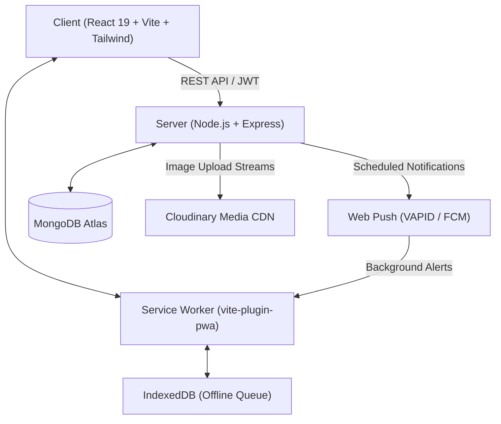
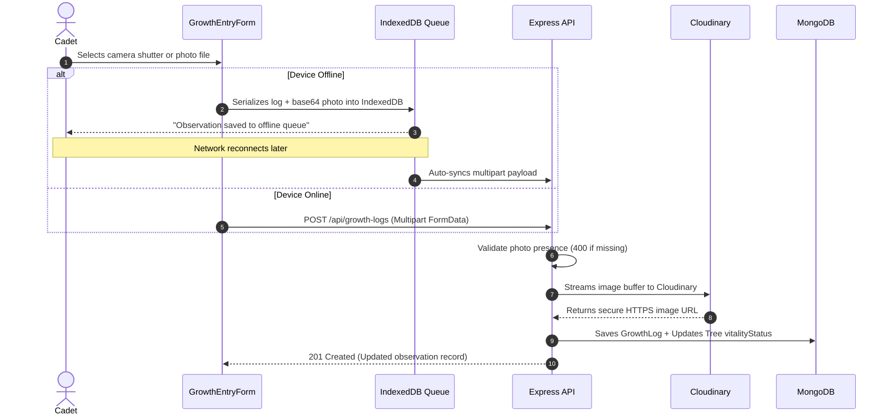

# 🏛️ LAMBO System Architecture & Engineering Specifications

This document outlines the software architecture, data models, authentication security, and modular expansion patterns of **LAMBO (Landscape Analytics for Monitoring Botanical Observation)**.

---

## 🗺️ 1. High-Level System Overview

LAMBO is engineered as an offline-capable, client-server progressive web application (PWA).



---

## 🗄️ 2. Core Data Models

### A. User Schema (`server/src/models/User.js`)
Handles authentication, role designation, academic enrollment, and push credentials:

```javascript
{
  name: { type: String, required: true },
  rollNumber: { type: String, required: true, unique: true, uppercase: true },
  password: { type: String, required: true },
  role: { 
    type: String, 
    enum: ['student', 'officer'], 
    default: 'student' 
  },
  course: { type: String, default: '' },
  phone: { type: String, default: '' },
  avatar: { type: String, default: '' },
  pushSubscriptions: [
    {
      endpoint: String,
      keys: { p256dh: String, auth: String },
      createdAt: { type: Date, default: Date.now }
    }
  ],
  createdAt: { type: Date, default: Date.now }
}
```

### B. Tree Specimen Schema (`server/src/models/Tree.js`)
Represents an individual seedling planted and assigned on campus:

```javascript
{
  treeId: { type: String, required: true, unique: true }, // e.g. LMB-0001
  owner: { type: ObjectId, ref: 'User', required: true },
  species: { type: String, required: true },
  nickname: { type: String, default: '' },
  location: { type: String, default: '' },
  coordinates: {
    lat: { type: Number, default: null },
    lng: { type: Number, default: null }
  },
  datePlanted: { type: Date, default: Date.now },
  vitalityStatus: {
    type: String,
    enum: ['Thriving', 'Stable / Fair', 'Distressed / At Risk', 'Dead / Mortality'],
    default: 'Thriving'
  },
  currentStage: {
    type: String,
    enum: ['Seedling', 'Vegetative', 'Flowering', 'Fruit Set', 'Ripening', 'Harvest'],
    default: 'Seedling'
  },
  photos: [
    {
      url: { type: String, required: true },
      caption: String,
      uploadedAt: { type: Date, default: Date.now }
    }
  ]
}
```

### C. Growth Observation Log Schema (`server/src/models/GrowthLog.js`)
Sequential botanical measurements recorded over time:

```javascript
{
  tree: { type: ObjectId, ref: 'Tree', required: true },
  loggedBy: { type: ObjectId, ref: 'User', required: true },
  height: { type: Number, required: true, min: 0 }, // cm
  stemDiameter: { type: Number, default: null, min: 0 }, // mm
  leafCount: { type: Number, default: null, min: 0 },
  fruitCount: { type: Number, default: null, min: 0 },
  growthStage: {
    type: String,
    enum: ['Seedling', 'Vegetative', 'Flowering', 'Fruit Set', 'Ripening', 'Harvest'],
    default: 'Seedling'
  },
  vitalityStatus: {
    type: String,
    enum: ['Thriving', 'Stable / Fair', 'Distressed / At Risk', 'Dead / Mortality'],
    default: 'Thriving'
  },
  photo: { 
    type: String, 
    required: [true, 'Observation photograph is mandatory'] 
  },
  notes: { type: String, default: '' },
  loggedAt: { type: Date, default: Date.now }
}
```

---

## 🔐 3. Role-Based Access Control (RBAC)

LAMBO employs a two-tier permission model:

1. **`student`**:
   - Access to own assigned trees and growth records.
   - Global map viewing and QR code scanning.
   - Profile management and push reminder configuration.
   - Enforced restriction: Cannot view other students' private log lists or access administrative cohorts.

2. **`officer`**:
   - Possesses all `student` privileges.
   - Access to `/officer/dashboard` (Officer Command Portal).
   - Global cadet compliance inspection (roster, overdue monitoring, photo audit).
   - Cohort-wide Excel export for academic grading.
   - Officer badge display in navigation and profile popout.

### Backend Protection Middleware
```javascript
// server/src/middleware/auth.js
const protect = async (req, res, next) => { /* verifies JWT */ };

const requireOfficer = (req, res, next) => {
  if (req.user && req.user.role === 'officer') {
    return next();
  }
  return res.status(403).json({
    success: false,
    message: 'Access Denied: NSTP Officer clearance required.'
  });
};
```

---

## 📷 4. Mandatory Observation Photo Pipeline



---

## 🎮 5. Forward-Compatibility: v3 Gamification Foundation

The user model and growth logging pipeline are architected to support **v3 Gamification** without breaking schema migrations:

1. **Care Streaks**:
   - Because `GrowthLog` maintains indexed `loggedAt` and `loggedBy` timestamps, streak calculations (`currentStreak`, `longestStreak`) can be computed dynamically or cached onto user records.
2. **Achievement Badges**:
   - Events in `growthLogController` (e.g. `isFirstFruit`, `isTenthLog`, `isZeroMortalityCohort`) can trigger an event-emitter pattern:
   ```javascript
   // Future v3 event dispatch:
   // eventBus.emit('growthLogCreated', { user, tree, log });
   ```
3. **Care Score Leaderboard**:
   - Compliance points (+10 for on-time weekly log, +5 for height milestone, +15 for survival confirmation) can aggregate from existing `GrowthLog` and `Tree` counts.
