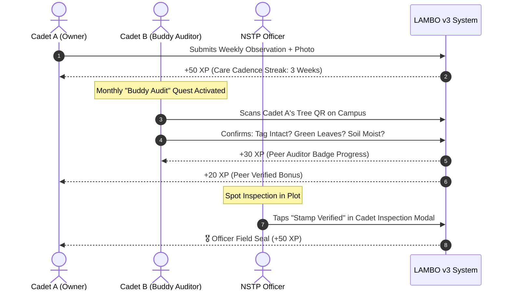

# 🛡️ LAMBO v3 — Anti-Cheat, Compliance & Plant Integrity Analysis

> **Document Version:** 1.0.0  
> **Target Release:** v3.0.0 (Gamification & Field Integrity Release)  
> **Scope:** Threat modeling, behavioral psychology, physical tampering, algorithmic verification, and pedagogical countermeasures against plant swapping and gamification exploitation.

---

## 🎯 Executive Summary

Gamifying academic forestry or campus wildling stewardship introduces a classic dilemma governed by **Goodhart's Law**:
> *"When a measure becomes a target, it ceases to be a good measure."*

If students earn grades, XP, or leaderboard rankings based on seedling survival or growth speed, students will naturally seek the path of least resistance. When a seedling dies or fails to grow, panic sets in, leading to:
- **Seedling Swapping**: Moving QR tags to a healthier wildling on campus or purchasing an identical potted plant from a commercial nursery.
- **Photo Recycling**: Re-uploading slightly cropped old photos or taking multiple photos on day one and trickling them out over weeks.
- **Metric Inflation**: Fabricating height and stem diameter numbers without actually measuring in the field.
- **Batch Spamming**: Rapidly submitting multiple observation logs in a single day to farm XP.

This document formalizes the **Threat Model**, analyzes why students cheat, and outlines a **Defense-in-Depth Framework** that combines physical, algorithmic, pedagogical, and social verification to preserve data integrity while keeping the experience encouraging and fun.

---

## 🔬 1. Threat Model & Cheat Vectors

```
                               ┌────────────────────────────────────────────────────────┐
                               │           V3 THREAT VECTORS IN BOTANY AUDIT            │
                               └────────────────────────────────────────────────────────┘
                                                         │
         ┌────────────────────────┬──────────────────────┴───────────────┬────────────────────────┐
         ▼                        ▼                                      ▼                        ▼
┌──────────────────┐    ┌──────────────────┐                   ┌──────────────────┐    ┌──────────────────┐
│  PLANT SWAPPING  │    │  PHOTO FORGERY   │                   │ METRIC INFLATION │    │  RAPID FARMING   │
├──────────────────┤    ├──────────────────┤                   ├──────────────────┤    ├──────────────────┤
│• Tag transplanted│    │• Recycled photos │                   │• Exaggerated cm  │    │• 10 logs in 1 hr │
│• Market plant sub│    │• Cropped shots   │                   │• Fabricated dia  │    │• Spammed watering│
│• Peer tree mimic │    │• Stock / AI pics │                   │• Growth curves   │    │• Off-schedule XP │
└──────────────────┘    └──────────────────┘                   └──────────────────┘    └──────────────────┘
```

### Threat 1: The "Plant Swap" (Physical Replacement)
- **Vector 1A (Campus Tree Hijacking):** A student's wildling dies. The student removes the physical QR tag and hangs it on a wild tree or an unassigned seedling growing naturally on campus.
- **Vector 1B (Commercial Nursery Replacement):** A student buys a ₱50 nursery seedling of the same species (e.g., Guyabano or Mahogany) and swaps it into their designated plot or pot.
- **Vector 1C (Peer Tree Mimicry):** Two students share one healthy tree, swapping the tag before taking each photo.

### Threat 2: Photographic Forgery & Remote Logging
- **Vector 2A (Gallery Trickle):** Taking 12 photos of a healthy seedling on Week 1 from slightly different angles and uploading one every week without ever visiting the field.
- **Vector 2B (Staged Backyard Plot):** Taking the wildling home instead of keeping it in the campus field station, photographing it in a garden with different lighting/soil.
- **Vector 2C (Identical Duplicate Photos):** Two cadets uploading the exact same image file to both their accounts.

### Threat 3: Data & Metric Falsification
- **Vector 3A (Linear Guesswork):** Adding exactly `+2.0 cm` every week in the UI without using a measuring tape.
- **Vector 3B (Leaderboard Chasing):** Inflating height to 85 cm to claim rank #1 on the NSTP leaderboard.

### Threat 4: Batch Spamming (XP Exploitation)
- **Vector 4A (Log Flooding):** Submitting 5 logs in 15 minutes before the officer's inspection deadline to claim weekly streak bonuses.

---

## 💡 2. The Core Psychological Insight: Why Students Cheat

Interviews with students in citizen science and campus agricultural projects reveal one universal root cause:

> **The Fear of Failure Penalty.**  
> In tropical forestry, wildling seedling mortality is naturally 20% to 50% due to heat stress, soil transplant shock, and monsoon rains. If the grading or ranking system treats a dead plant as an academic failure or zero points, students **must** cheat to protect their GPA.

### The Pedagogical Fix: The "Honest Mortality & Autopsy" Protocol
Instead of penalizing dead plants:
1. **Never deduct points for a dead plant.**
2. When a plant enters `'Dead / Mortality'` vitality status, offer an **Autopsy & Post-Mortem Quest**:
   - The student logs an honest mortality report with a clear photo of the dead specimen.
   - The student completes a diagnostic checklist: Was it root rot (overwatering)? Desiccation (drought)? Stem borer (pests)? Animal grazing?
   - The student earns the **"Scientific Integrity"** badge and **equal or bonus XP** for diagnosing the failure!
   - An NSTP Officer reviews and approves a **Replant Voucher**, issuing a new seedling ID.
3. **Outcome:** A student has **zero incentive** to spend money on a nursery plant or steal a tag, because being honest about death is rewarded just as highly as a thriving plant!

---

## 🛡️ 3. Multi-Layered Countermeasure Architecture

```mermaid
graph TD
    subgraph "Layer 1: Game Mechanics"
        M1["Process > Growth XP"]
        M2["Streak Cooldowns (1 log/wk)"]
        M3["Honest Mortality Protocol"]
    end

    subgraph "Layer 2: Physical Verification"
        P1["Tamper-Evident Zip Ties with Serial No."]
        P2["Standardized Reference Measurement Stake"]
        P3["Tagged Background Landscape Markers"]
    end

    subgraph "Layer 3: Algorithmic Auditing"
        A1["GPS Campus Geofencing (35m radius)"]
        A2["Biological Plausibility Delta Engine"]
        A3["Perceptual Image Hash Duplicate Detection"]
    end

    subgraph "Layer 4: Social & Officer Oversight"
        S1["Peer Cross-Inspection Quests"]
        S2["Officer Tactical Field Stamps"]
        S3["Anomaly Roster Flagging"]
    end

    M1 & P1 & A1 & S1 --> VERIFIED["High-Trust Botanical Ledger"]
```



### Layer 1: Game Mechanics & Reward Architecture

| Mechanic | How It Prevents Cheating |
| :--- | :--- |
| **Stewardship Over Size** | **90% of XP** is earned from *regularity of care* (watering, weeding notes, weekly cadence) and *observational detail* (logging soil condition, leaf health). Raw height gives minimal XP. |
| **Weekly XP Cooldown** | Cadets can log observations at any time for botanical records, but XP can only be earned **once every 5 to 7 days**. Submitting 10 logs in one day grants zero extra XP. |
| **Micro-Leaderboards** | Replace one global "biggest tree" leaderboard with **Cadet Rank Tiers** (Scout → Warden → Forest Ranger) and **Class Section Cooperative Goals** (e.g., "BS-Agri 1A reaches 90% survival rate"). When success is cooperative, students help peers water their plants. |

---

### Layer 2: Physical & Environmental Controls

| Control | Description |
| :--- | :--- |
| **Tamper-Evident Serialized Ties** | Instead of loose string, tags are fastened using numbered security zip-ties (cost < ₱2 each). The serial number (e.g. `SN-88214`) is stamped on the tie and recorded in the tree profile. Removing it requires cutting the tie. |
| **Standardized Reference Stake** | Each wildling is planted next to a fixed bamboo or PVC stake painted with alternating 10cm dark/light bands. Every observation photo must show the plant against this stake, making height fabrication instantly obvious. |
| **Visual Environmental Continuity** | Plants are rooted in a specific physical environment: soil color, surrounding grass, adjacent fencing, or campus topography. An officer inspecting the chronological timeline (`GrowthTimeline.jsx`) can visually confirm background continuity in seconds. |

---

### Layer 3: Algorithmic Verification & Anomaly Detection

#### A. GPS Campus Geofencing
- During specimen registration (`RegisterTreePage.jsx`), coordinates are pinned to the campus planting plot (e.g., CTU Barili Agri zone: `10.1472° N, 123.5381° E`).
- When a log is submitted, the client queries device GPS via the browser Geolocation API.
- If the submission distance exceeds **35 meters** from the registered coordinate:
  - The log is **not rejected** (to avoid failing due to canopy GPS drift or offline sync).
  - The log is marked with `geofenceMismatch: true` and distance delta in meters.
  - An amber badge `[📍 Off-Plot: +120m]` appears on the officer's inspection view.

#### B. Biological Plausibility Delta Engine
The server validates measurements against forestry growth models:
- **Maximum Growth Threshold:** $\Delta \text{Height} > 12 \text{ cm}$ in 7 days for a seedling triggers an anomaly flag: `[⚠️ Abnormal Growth Surge]`.
- **Shrinkage Anomaly:** $\Delta \text{Height} < -4 \text{ cm}$ triggers a flag: `[⚠️ Specimen Shrinkage]`, unless the cadet checked the "Pruned / Broken Leader Branch" toggle in the form.
- **Stem-to-Height Ratio:** Warns if stem diameter is 2 mm while height is reported as 120 cm (physically unstable bamboo-stick error).

#### C. Perceptual Image Hashing (Duplicate Detection)
- Uploaded photos pass through a lightweight 64-bit dHash (difference hash) calculation.
- If a hash matches a photo uploaded in a previous week or by another student within Hamming distance $< 5$, the submission is flagged: `[⚠️ Suspected Duplicate Photo]`.

---

### Layer 4: Social & Collaborative Auditing



1. **Buddy Audit Missions:** Cadets are randomly paired once a month to inspect each other's specimens. This turns peer surveillance into a collaborative camaraderie game.
2. **Officer Field Seals:** Officers visiting the plot tap a one-click "Verified in Field" button. Cadets receive high-prestige profile badges and XP boosts, creating positive motivation to maintain their physical plot.

---

## 📊 4. Comparison Matrix: Traditional vs. Anti-Cheat Gamification

| Dimension | Traditional Naive Gamification | LAMBO v3 Integrity Gamification |
| :--- | :--- | :--- |
| **Primary Metric** | Raw height & tree survival | Care consistency, observational detail & streak |
| **Leaderboard Scope** | Single global competitive ranking | Tiered rank badges & cohort cooperative goals |
| **Handling Plant Death** | 0 points / grade deduction (leads to cheating) | Autopsy & Replant quest with full XP credit |
| **Photo Verification** | Any photo accepted | Mandatory camera capture + geofence + background check |
| **Tag Security** | Loose paper QR tag | Serialized zip tie + fixed reference measurement stake |
| **Peer Dynamic** | Jealous competition | Collaborative buddy audits & platoon survival goals |

---

## 🚀 5. Implementation Roadmap for v3 Anti-Cheat Engine

- [ ] **Phase 1: Game Economy Design** — Implement weekly rate limiter, care streak multiplier, and non-zero-sum rank tiers.
- [ ] **Phase 2: Honest Mortality Quest** — Add "Request Autopsy" workflow in `GrowthEntryForm.jsx` and officer approval queue.
- [ ] **Phase 3: Geofence Validation** — Capture GPS coordinate on capture; compute Haversine distance against tree baseline.
- [ ] **Phase 4: Biological Delta Guards** — Add server-side growth anomaly check in `growthLogController.js`.
- [ ] **Phase 5: Officer Audit Badges** — Add "Stamp Verified" action in `CadetInspectionModal.jsx`.
