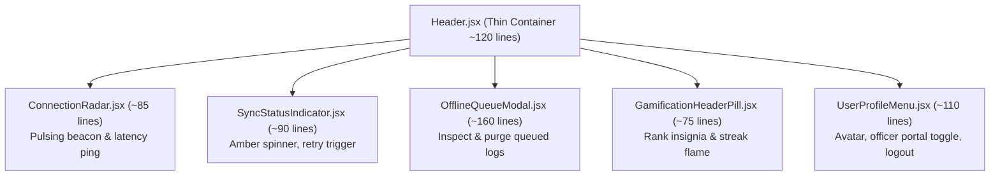
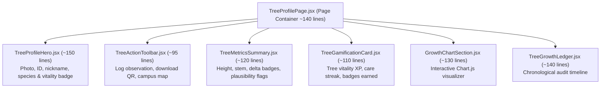
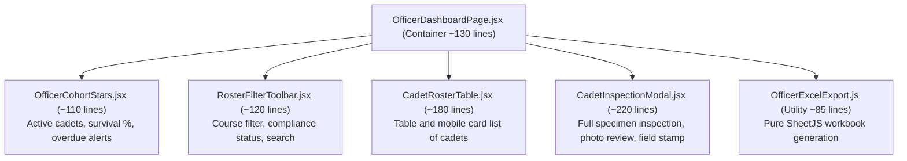

# 🏗️ LAMBO v3 — Frontend Modular Architecture & Code Refactoring Plan

> **Document Version:** 1.0.0  
> **Target Release:** v3.0.0  
> **Status:** Architecture Blueprint

---

## 🎯 1. Motivation & Audit of Current Monoliths

As LAMBO grew through v1.0 and v2.0, several core pages and components accumulated heavy responsibilities, resulting in monolithic files exceeding 500–1,000+ lines of code:

### Monolithic File Audit Table

| File Path | Current Lines | Current Responsibilities / Code Smells | Target Modular Structure |
| :--- | :---: | :--- | :--- |
| `client/src/components/layout/Header.jsx` | **1,144** | Connectivity radar, offline queue modal, sync listeners, user profile dropdown, officer navigation, mobile drawer, haptic triggers. | Decompose into 5 focused sub-components under `components/layout/header/` (each < 150 lines). |
| `client/src/pages/TreeProfilePage.jsx` | **1,019** | Specimen hero header, action toolbar, metric stat cards, Chart.js toggles, chronological growth timeline, tree metadata edit modal, full photo lightbox. | Decompose into 6 modular sub-components under `components/tree/profile/` (each < 180 lines). |
| `client/src/pages/OfficerDashboardPage.jsx` | **929** | Cohort KPI calculations, multi-filter toolbar, cadet roster table, cadet inspection drawer/modal, SheetJS Excel export engine. | Decompose into 5 sub-components + 1 pure export utility under `components/officer/`. |
| `client/src/pages/RegisterTreePage.jsx` | **742** | Botanical species taxonomy picker, camera shutter capture, interactive Leaflet coordinate picker, baseline metric validation. | Decompose into 4 step components under `components/tree/register/`. |
| `client/src/pages/GrowthLogsPage.jsx` | **588** | Observation list rendering, date range filtering, photo lightboxes, delete confirmation dialogues. | Decompose into log list, filter bar, and observation preview card. |
| `client/src/components/growth/GrowthEntryForm.jsx` | **544** | HTML5 canvas image compressor, camera preview, metric inputs, vitality tier radio selector, offline queue submission. | Decompose into photo capture pipeline, telemetry inputs, and vitality picker. |
| `client/src/components/scan/QRScannerView.jsx` | **530** | Camera lifecycle, html5-qrcode DOM attachments, HUD overlay animation, torch toggle, manual tree ID input. | Decompose into scanner HUD, camera engine, and manual ID fallback. |
| `client/src/pages/CampusMapPage.jsx` | **525** | Leaflet canvas management, marker clustering, vitality filter chips, specimen popup cards, legend drawer. | Decompose into map canvas, filter controls, specimen popup, and legend drawer. |

---

## 🏛️ 2. Architectural Design Patterns for v3

To ensure code remains clean, testable, and maintainable as gamification features (XP toasts, badge modals, streak indicators) are introduced, we adopt four core design patterns:

### Pattern 1: Container / Presenter Separation
- **Page Container (Smart):** Fetches data, coordinates contexts, manages high-level routing, and passes props. Keeps JSX under 150 lines.
- **Presenter Components (Dumb):** Pure visual components that receive data and callbacks via props. Reusable across student and officer views.

### Pattern 2: Domain-Specific Custom Hooks
Extract stateful business logic out of UI components into dedicated hooks:
- `useNetworkRadar()` — Manages online/offline ping, radar beacon pulses, and connection retries.
- `useOfflineQueue()` — Manages queue count, sync state, and pending payload inspection.
- `useGamification()` — Manages XP balance, current rank tier, streak counts, and level-up popups.
- `useTreeMetrics(treeId)` — Computes growth deltas, height trends, and biological plausibility warnings.

### Pattern 3: Atomic Component Directory Layout
Instead of dumping all components into single flat folders, group components strictly by feature domain:
```
client/src/
├── components/
│   ├── common/             # Atomic buttons, badges, modals, tooltips
│   ├── gamification/       # XPToast, RankBadge, StreakFlame, MedalCard, LevelUpModal
│   ├── layout/
│   │   ├── header/         # ConnectionRadar, SyncIndicator, QueueModal, UserProfileMenu
│   │   └── nav/            # BottomNav, MobileDrawer
│   ├── tree/
│   │   ├── profile/        # HeroSection, MetricsCards, ActionToolbar, TreeEditModal
│   │   └── register/       # SpeciesPicker, PhotoCaptureStep, LocationPickerStep
│   ├── growth/             # EntryForm, PhotoUploader, VitalitySelector, TimelineRail
│   ├── officer/            # CohortStats, RosterTable, CadetInspectionModal, ExcelExporter
│   └── scan/               # ScannerHUD, CameraEngine, ManualIdInput
```

---

## 📋 3. Detailed Component Decomposition Blueprints

### Blueprint 1: `Header.jsx` Refactoring (1,144 → 120 lines)



#### New Sub-Components:
1. `components/layout/header/ConnectionRadar.jsx`: Real-time connectivity beacon, online/offline state, manual re-check trigger.
2. `components/layout/header/SyncStatusIndicator.jsx`: Rotating amber sync spinner, "Synced ✓" emerald flash, DB active pulse.
3. `components/layout/header/OfflineQueueModal.jsx`: Modal drawer showing pending offline records, retry all, and clear queue actions.
4. `components/layout/header/GamificationHeaderPill.jsx`: Displays cadet's current rank insignia (`🌿 Scout`), level progress bar, and active streak flame.
5. `components/layout/header/UserProfileMenu.jsx`: Profile dropdown, role badge, NSTP officer switch, and account settings.

---

### Blueprint 2: `TreeProfilePage.jsx` Refactoring (1,019 → 140 lines)



---

### Blueprint 3: `OfficerDashboardPage.jsx` Refactoring (929 → 130 lines)



---

## 🛠️ 4. Phased Execution Roadmap

To ensure zero regressions in existing v2 functionality, refactoring is executed in discrete, tested stages:

- [ ] **Stage 1: Atomic Foundation & Common Components**
  - Verify all shared UI elements (`Button.jsx`, `Badge.jsx`, `Modal.jsx`, `Icon.jsx`) are standardized.
  - Create `GamificationContext.jsx` and dummy hooks.
- [ ] **Stage 2: Header & Navigation Modularization**
  - Extract `ConnectionRadar`, `SyncStatusIndicator`, `OfflineQueueModal`, and `UserProfileMenu`.
  - Validate online/offline toggling and sync transitions in browser.
- [ ] **Stage 3: Tree Profile Decomposition**
  - Extract `TreeProfileHero`, `TreeMetricsSummary`, `TreeActionToolbar`, and `GrowthChartSection`.
  - Ensure growth deltas and timeline remain 100% accurate.
- [ ] **Stage 4: Officer Dashboard Decomposition**
  - Extract `OfficerCohortStats`, `RosterFilterToolbar`, `CadetRosterTable`, and `CadetInspectionModal`.
  - Verify Excel export functionality and cadet inspection modal work seamlessly.
- [ ] **Stage 5: Observation Form & Scanner Decomposition**
  - Modularize `GrowthEntryForm.jsx` and `QRScannerView.jsx`.
  - Retain client-side HTML5 canvas compression and camera shutter mechanics.
