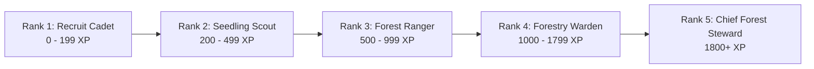
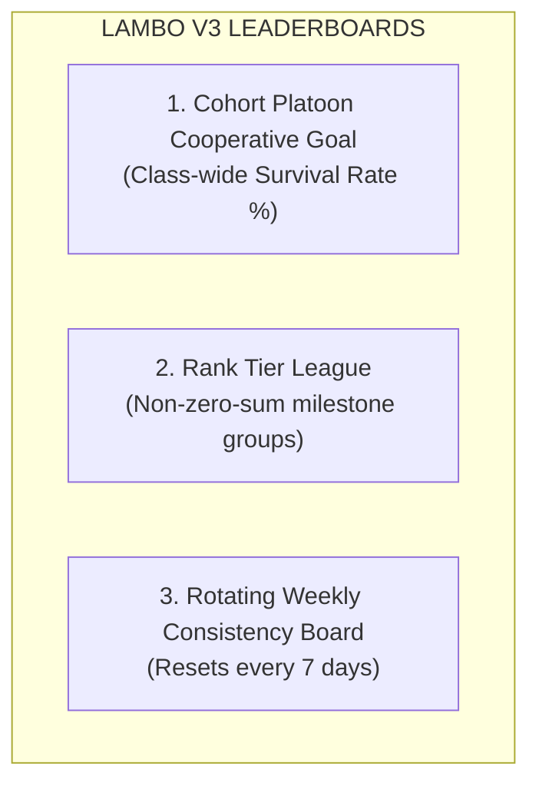

# 🎮 LAMBO v3 — Gamification & Engagement Specification

> **Document Version:** 1.0.0  
> **Target Release:** v3.0.0  
> **Status:** Specification Draft

---

## 🎯 1. Gamification Vision & Philosophy

LAMBO v3 introduces an academic stewardship gamification engine designed to transform routine botanical forestry requirements into an engaging, habit-forming experience.

### Core Principles
1. **Stewardship Over Speed:** Points are earned through consistency, observational rigor, and reliable care habits—not genetic tree growth or physical size.
2. **Non-Zero-Sum Progression:** Every student can reach the highest rank (Chief Forest Steward) through dedication. Rankings celebrate personal milestones and platoon teamwork.
3. **Resilience Over Perfection:** Honest scientific reporting of plant mortality is rewarded equally to healthy specimens, removing incentives to cheat or swap seedlings.
4. **Tactical Aesthetic Continuity:** Gamification elements follow LAMBO's military-botanical visual language (olive drab surfaces, high-contrast amber/emerald indicators, ribbon badges, tactical medals, and JetBrains Mono data readouts).

---

## 🎖️ 2. Forester Rank & Progression System

Cadets advance through 5 distinct **Forester Ranks** as they accumulate Experience Points (XP):



### Rank Tiers & Privileges

| Rank | Title | XP Required | Insignia | Privileges & Unlocks |
| :---: | :--- | :---: | :---: | :--- |
| **I** | **Recruit Cadet** | 0 XP | 🪖 | Access to basic tree registration and observation logging. |
| **II** | **Seedling Scout** | 200 XP | 🌿 | Unlocks custom tree nicknames, personal growth milestones, and historical chart smoothing. |
| **III** | **Forest Ranger** | 500 XP | 🧭 | Eligible for **Buddy Auditor** missions (cross-inspecting classmate specimens). |
| **IV** | **Forestry Warden** | 1,000 XP | 🛡️ | Profile featured in Cohort Honor Roll; eligible to assist NSTP Officers with field inspections. |
| **V** | **Chief Forest Steward** | 1,800 XP | 🎖️ | Permanent Golden Oakleaf badge; formal commendation certificate exportable for NSTP graduation portfolio. |

---

## 💰 3. The XP Economy & Activity Rules

To prevent batch spamming and Goodhart's Law gaming, XP awards are governed by strict cooldowns and process-based point distributions:

| Action Category | Specific Action | XP Award | Rate Limit / Cooldown |
| :--- | :--- | :---: | :--- |
| **Seedling Baseline** | Initial Specimen Registration + Tagging | **+100 XP** | One-time per allocated tree |
| **Weekly Care** | Mandatory Observation Log with Photo | **+50 XP** | Max 1 per 5-day cycle |
| **Care Streak** | 2-Week Consecutive Logging Streak | **+20 XP** | Cumulative bonus |
| **Care Streak** | 4-Week Consecutive Logging Streak | **+50 XP** | Cumulative bonus |
| **Care Streak** | 8-Week Master Forest Streak | **+150 XP** | Cumulative bonus |
| **Scientific Rigor** | Full Audit (Stem dia + Leaf count + Notes) | **+25 XP** | Added to weekly log |
| **Honest Science** | Verified Mortality & Autopsy Report | **+100 XP** | Awarded upon officer approval |
| **Social Stewardship** | Completed Buddy Cross-Inspection | **+30 XP** | Max 1 per month |
| **Social Stewardship** | Your Tree Verified by Peer Buddy | **+20 XP** | Max 1 per month |
| **Field Inspection** | Officer Field Seal of Excellence | **+50 XP** | Conferred during officer spot-check |

> [!IMPORTANT]
> **Anti-Spam Cooldown:** A cadet may submit observation logs at any time for scientific record-keeping. However, **XP for weekly observations is awarded at most once every 5 calendar days**. Subsequent logs within the same window record botanical telemetry but grant 0 XP.

---

## 🔥 4. Care Cadence & Streak Engine

The **Stewardship Streak** tracks weekly consistency across the academic semester:

```
[Week 1: Logged] ➔ [Week 2: Logged] ➔ [Week 3: Logged] ➔ 🔥 3-WEEK STREAK (1.2x XP Boost)
```

- **Active Observation Window:** A 7-day rolling window begins on Sunday 00:00 and closes on Saturday 23:59.
- **Grace Period (Streak Freeze):** Each cadet receives **one free "Field Pass / Freeze"** per semester, which prevents streak reset if severe weather (typhoon/monsoon) or illness prevents visiting campus plots.
- **Visual Feedback:** A tactical pulsing flame icon (`🔥 Streak: 4 Weeks`) displayed in the header and profile with streak multiplier bonuses.

---

## 🏅 5. Badge Catalog (Tactical Medals)

Badges are awarded across four distinct branches of accomplishment:

### Branch A: Consistency & Stewardship
- 🥉 **First Leaf** — Completed baseline registration and first growth observation.
- 🥈 **Reliable Steward** — Maintained a 4-week uninterrupted observation streak.
- 🥇 **Iron Oak** — Maintained an 8-week uninterrupted observation streak.
- 💎 **Centurion Care** — Logged 15 verified field observations across the semester.

### Branch B: Botanical & Scientific Rigor
- 🔬 **Macro Botanist** — Recorded stem caliper diameter, leaf count, and fruit count in 5 consecutive logs.
- 📋 **Field Journalist** — Added detailed field observation notes (>50 characters) on 5 separate entries.
- 🌦️ **Weather Tested** — Logged an observation during challenging weather or adverse season conditions.

### Branch C: Integrity & Resilience
- 🧬 **Scientific Integrity** — Reported an honest seedling mortality and completed the diagnostic autopsy checklist.
- 🌱 **Phoenix Wildling** — Successfully replanted and established a second-generation seedling following an approved autopsy.

### Branch D: Cohort & Community Leadership
- 🤝 **Classmate Comrade** — Successfully conducted a peer Buddy Audit on a classmate's seedling.
- 🎖️ **Officer Commendation** — Received 2+ direct "Field Verified" seals from an NSTP Officer.

---

## 🏆 6. Non-Toxic Leaderboard Architecture

Traditional leaderboards breed resentment and drive students to cheat. LAMBO v3 deploys a **Three-Tier Non-Toxic Leaderboard Design**:



### 1. Cohort Cooperative Goal (Primary Spotlight)
- Displays aggregate class performance (e.g. `BS-Agri 1A — Overall Survival Rate: 88% | 142 of 160 Seedlings Thriving`).
- When the cohort hits 85% survival rate, all enrolled students earn an end-of-term **"Forest Custodian Platoon"** badge.
- Encourages cadets to remind and assist their peers rather than compete against them.

### 2. Rank Tier League (Milestone Groups)
- Rather than rank #1 to #150, students are grouped by their achieved rank (e.g. "All Forestry Wardens").
- Everyone in the group shares the tier's prestige.

### 3. Rotating Weekly Consistency Board (Micro-Leaderboard)
- Shows the top 10 most consistent contributors *for the current week only*.
- Resets every Sunday at midnight so early leaders do not monopolize the board all semester.

---

## 📱 7. Tactical UI/UX Micro-Interactions

Gamification in LAMBO v3 feels tactile, responsive, and military-precise:
- **XP Floating Toast:** Upon submitting a verified observation log, a smooth animated toast slides in from the tactical pill header: `+50 XP • CARE CADENCE [🔥 STREAK 3]`.
- **Level-Up Modal:** Elevating to a new Forester Rank triggers an army-green modal with sound/vibration haptics, displaying the new insignia and unlocked privileges.
- **Inspection Verification Ripple:** When an officer stamps a tree in the field, the student's specimen card displays an animated green radar pulse with the officer's stamp badge.
