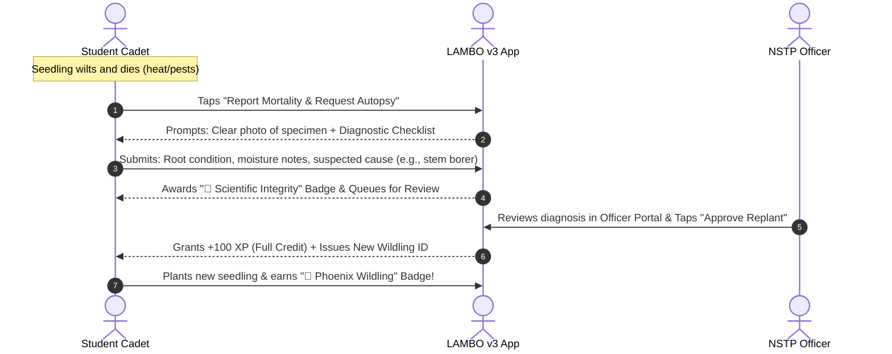
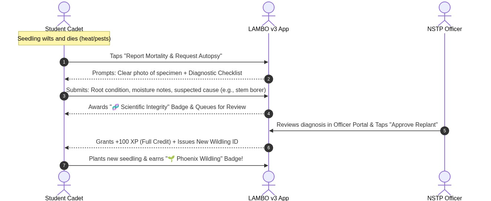
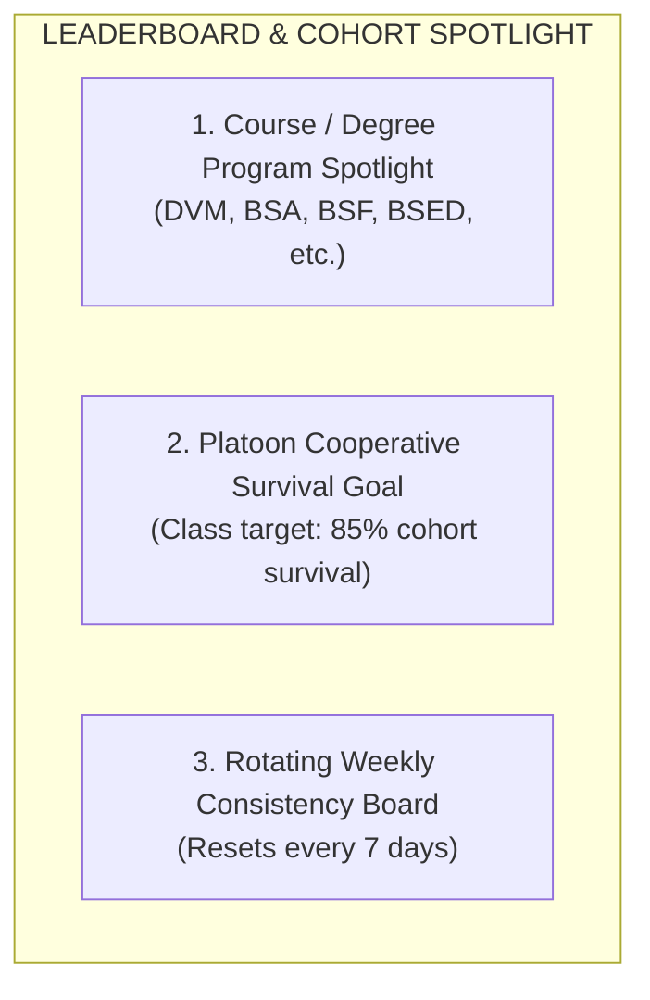
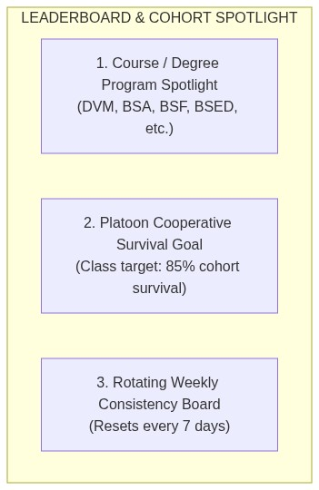

# 📋 LAMBO v3 — NSTP Stakeholder Review & Gamification Proposal

> **Document Type:** Strategic Proposal & Design Specification for Stakeholder Review  
> **Prepared For:** NSTP Instructors, Forestry Coordinators, and Project Reviewers  
> **Target Release:** LAMBO v3.0 (Gamification, Field Integrity & Architecture Release)  
> **Status:** 🟡 **Open for Review & Feedback**  
> **Formats Available:** 📄 [**Open Formatted PDF (Ready to Share)**](./NSTP_STAKEHOLDER_REVIEW_PROPOSAL.pdf) • 🌐 [**Interactive HTML (Copy to Google Docs)**](./NSTP_STAKEHOLDER_REVIEW_PROPOSAL.html)

---

## 🌿 Executive Summary

The National Service Training Program (NSTP) campus forestry and wildling stewardship initiative aims to instill environmental responsibility, botanical literacy, and civic engagement. However, converting mandatory tree planting into sustained, long-term seedling care across an entire semester presents major operational hurdles:

1. **Student Dropout & Neglect:** Seedlings are planted on Day 1, but without ongoing incentives, weekly watering, weeding, and observations decline sharply.
2. **The "Plant Swapping" Trap:** Wildling seedlings have a natural mortality rate of 20% to 50% in tropical field conditions. If students fear that a dead plant will lower their grade or drop their leaderboard rank, they are incentivized to swap physical tags onto other trees, purchase commercial nursery seedlings, or recycle old photos.
3. **Goodhart's Law in App Gamification:** Rewarding raw height or plant size leads to metric inflation (students fabricating +15cm growth) and disadvantages students assigned to slow-growing hardwood species.

This proposal outlines a **pedagogical gamification framework** and an **anti-cheat botanical integrity system** that rewards *disciplined stewardship*, eliminates the fear driving plant swaps, respects plant biology without damaging delicate stems, and gives NSTP officers seamless oversight.

> 💬 **Reviewer Note:**  
> Please review the proposals, highlighted questions, and alternatives throughout this document. Feel free to mark sections with your feedback, suggestions, or institutional constraints before we begin code implementation.

---

## 🛡️ 1. The Anti-Swap & Plant Integrity System

### The Challenge: How to Prevent Plant Swapping Without Damaging the Seedling
When we consider tagging young wildlings with tamper-evident seals (such as serialized zip ties), a serious botanical risk arises:

> [!WARNING]
> **Vascular Girdling Hazard:**  
> Young seedlings have soft, actively dividing vascular cambium tissue. If a plastic zip tie or wire is tightened directly around the stem, the plant will become **girdled** as it grows. Girdling strangles the phloem vessels, blocking nutrient flow and eventually killing the seedling.

### 💡 4 Safe Physical Tagging Solutions (Evaluated)

```
       Option 1: Stake-Mounted (Recommended)             Option 2: Loose-Loop Collar
      ┌───────────────────────────────────────┐         ┌─────────────────────────────────┐
      │   [Fixed Bamboo Stake]                │         │   [Seedling Stem]               │
      │    │  [Serialized Seal SN-4091]       │         │    │  (Soft Rubber Buffer)      │
      │    ├──[Laminated QR Code]             │         │    └──[3cm Loose Zip Ring]      │
      │    │  (Driven 40cm into soil)         │         │       (Zero tension on bark)    │
      │   [Seedling Stem tied with soft jute] │         └─────────────────────────────────┘
      └───────────────────────────────────────┘
```

| Method | How It Works | Botanical Safety | Anti-Swap Security | Cost / Practicality |
| :--- | :--- | :---: | :---: | :---: |
| **Option A: Stake-Mounted Seal (Recommended)** | A 1.2-meter bamboo or hardwood stake is driven 40 cm into the ground directly adjacent to the wildling. The serialized seal and laminated QR code are permanently stapled or locked to the stake. The seedling is loosely tied to the stake with biodegradable jute twine for wind support. | 🟢 **100% Safe:** Zero plastic or constriction touching the living stem. | 🟢 **High:** Removing the stake requires uprooting it from deep soil, visibly disturbing the plot. | 🟢 **Very Low:** Local bamboo stakes cost ~₱5 each. |
| **Option B: Loose-Loop Collar with Foam Buffer** | A serialized tamper-evident zip tie is locked into a wide loop (leaving a 3 to 4 cm gap around the lower woody base) with a soft silicone/foam spacer. | 🟡 **Safe if Monitored:** Must remain loose so it never tightens against the bark. | 🟡 **Moderate:** Could potentially be slid off over upper branches if seedling is small. | 🟢 **Very Low:** Zip ties cost ~₱1–2 each. |
| **Option C: Horticultural Aluminum Spiral Wrap** | Expandable aluminum soft strip with embossed serial number wrapped around the base. It uncoils naturally as the stem thickens. | 🟢 **Safe:** Expands with tree growth. | 🟡 **Moderate:** Can be carefully uncoiled and moved if not crimped tightly. | 🟠 **Moderate:** Requires specialty nursery tags. |
| **Option D: Ground Anchor Peg** | A galvanized wire peg with a stamped metal disc driven flush into the root zone soil next to the stem. | 🟢 **Safe:** In the ground, touches no foliage. | 🟡 **Moderate:** Can be pulled out unless barbed. | 🟡 **Low-Moderate:** Requires metal stamps. |

> [!TIP]
> **Recommendation:** **Option A (Stake-Mounted Tagging)** combined with a **Fixed Height Reference Stake**. The bamboo stake serves a dual purpose: it anchors the physical seal safely without touching the stem, and its painted 10cm bands act as a visual ruler in every observation photo!

---

### The Fixed Height Reference Stake
To prevent students from fabricating tree height (e.g. claiming +10 cm every week):
1. The bamboo stake has alternating **dark green and white 10cm painted bands**.
2. When students take an observation photo using `GrowthEntryForm.jsx`, the in-app camera reticle displays the guideline: *"Position seedling against the reference stake bands."*
3. Officers reviewing photos in the **Officer Command Portal** can verify the true height at a single glance without needing a physical tape measure.

---

### Algorithmic Safeguards: GPS Geofencing & Plausibility Checks

1. **GPS Campus Geofencing (CTU Barili Campus Plots):**
   - Each seedling's GPS location is locked upon baseline registration.
   - When a student submits a weekly log, the device captures current GPS coordinates.
   - If the log is submitted $>35\text{ meters}$ away from the designated campus plot, the submission is accepted (so students aren't blocked by temporary canopy GPS drift), but an amber flag `[📍 Off-Plot Log: +140m]` is pinned to the officer's inspection view.
2. **Biological Plausibility Delta Engine:**
   - Forest seedlings grow incrementally (typically 0.5 to 3 cm per week depending on species).
   - If a student logs $\Delta\text{Height} > 12\text{ cm}$ in 7 days, the system flags it: `[⚠️ Abnormal Growth Surge]`.
   - If height drops by $>4\text{ cm}$ (shrinkage), the form prompts the student: *"Did the seedling suffer physical damage or leader branch dieback?"*

---

## 🧬 2. The Game-Changer: The "Honest Mortality & Autopsy" Protocol

### Why Traditional Systems Drive Cheating
In traditional academic grading, a student whose plant dies receives a zero or failing marks. Because wildling mortality in tropical conditions is common, students are backed into a corner: **cheat or fail**.

### The LAMBO v3 Solution: Reward the Science of Plant Autopsy
Instead of penalizing plant mortality, LAMBO v3 converts seedling loss into a high-value scientific learning moment:





#### Why This Eliminates Plant Swapping:
- **Zero Loss of XP or Standing:** An honest death report grants full XP credit and a prestigious "Scientific Integrity" badge.
- **Zero Financial Cost:** The student does not need to spend money buying a replacement plant at a market.
- **Authentic Forestry Learning:** Students learn *why* plants die (root rot, drought, fungal damping-off, soil compaction), which is the core educational goal of NSTP forestry.

---

## 🎮 3. The Gamification Architecture

### Core Design Philosophy: Stewardship Over Size
- **90% of XP is awarded for consistent care and observational detail**, not tree height.
- A cadet whose slow-growing native hardwood (e.g. Molave or Narra) grows 2 cm over 8 weeks earns just as much XP as a cadet with a fast-growing fruit tree—as long as both water and inspect regularly.

---

### Forester Ranks & Milestone Progression

```
[Rank 1: Recruit Cadet] ➔ [Rank 2: Seedling Scout] ➔ [Rank 3: Forest Ranger] ➔ [Rank 4: Forestry Warden] ➔ [Rank 5: Chief Forest Steward]
       (0 XP)                    (200 XP)                  (500 XP)                  (1,000 XP)                  (1,800+ XP)
```

| Rank Level | Title | Insignia | XP Needed | Meaning & Privileges |
| :---: | :--- | :---: | :---: | :--- |
| **I** | **Recruit Cadet** | 🪖 | 0 XP | Enrolled in NSTP forestry; registered baseline wildling. |
| **II** | **Seedling Scout** | 🌿 | 200 XP | Maintained initial care; unlocked custom tree nicknames and milestones. |
| **III** | **Forest Ranger** | 🧭 | 500 XP | Proven stewardship; eligible for advanced field observation missions. |
| **IV** | **Forestry Warden** | 🛡️ | 1,000 XP | Senior steward; eligible to assist NSTP officers during plot surveys. |
| **V** | **Chief Forest Steward** | 🎖️ | 1,800 XP | Highest distinction; permanent Gold Medal; exportable NSTP Honors Certificate. |

---

### The XP Economy & Cooldowns

| Action | Points | Cooldown / Rules |
| :--- | :---: | :--- |
| **Baseline Tree Registration** | **+100 XP** | One-time per seedling |
| **Weekly Observation Log (with Mandatory Photo)** | **+50 XP** | Once per 5-day cycle (prevents batch spamming) |
| **Care Streak (2 Consecutive Weeks)** | **+20 XP** | Cumulative bonus |
| **Care Streak (4 Consecutive Weeks)** | **+50 XP** | Cumulative bonus + "Reliable Steward" Ribbon |
| **Detailed Botanical Telemetry** (Stem dia + leaves + soil notes) | **+25 XP** | Added to weekly log |
| **Honest Mortality Autopsy Report** | **+100 XP** | Upon officer review and approval |
| **Officer Field Seal of Excellence** | **+50 XP** | Conferred during officer in-person plot inspection |

---

### Academic Care Streaks & "Field Pass / Streak Freeze"
- **Weekly Observation Window:** A 7-day cycle running from Sunday to Saturday.
- **5-Day Cooldown:** Cadets can log extra observations anytime for science, but XP is capped at once per 5 days to prevent spamming 10 logs in one afternoon.
- **The "Field Pass" (Streak Freeze):** Each cadet receives **one free Streak Freeze** per semester. If a typhoon hits the campus, or if midterms/illness keep a student away from the plot, their streak is preserved automatically.

---

## 🏆 4. Course-Specific & Non-Toxic Leaderboards

Traditional global leaderboards (where 1 student is #1 and 150 students lose) cause toxic competition and demotivate students who fall behind. LAMBO v3 deploys a **Three-Pillar Recognition Model**:





### Pillar 1: Degree Program / Course Cohort Hubs
- Students and instructors can filter the dashboard by degree program (e.g. **DVM** - Doctor of Veterinary Medicine, **BSA** - BS Agriculture, **BSF** - BS Forestry).
- Shows aggregate cohort health:
  > *"CTU Barili DVM Cohort: 48 Cadets Enrolled • 94% Specimen Vitality • 8.4 Average Care Streak"*
- Fosters healthy inter-course pride and allows course instructors to track their own students independently.

### Pillar 2: Platoon Cooperative Goals
- The class section works together to achieve an **85% Cohort Survival Goal**.
- When the section reaches this target, every enrolled cadet earns the **"Forest Platoon Unit Commendation"** medal.
- Classmates actively remind and help each other water and weed plots.

### Pillar 3: Rotating Weekly Consistency Board
- Resets every Sunday at midnight.
- Highlights the top 10 most consistent students *this week*, giving newcomers an equal chance to be recognized every week.

---

## 🎖️ 5. Officer-Centric Field Authority & Auditing

Following design alignment, **field verification authority is held strictly by official NSTP Officers and Instructors** (rather than unverified student peer audits):

1. **Officer Field Inspection Modal (`CadetInspectionModal.jsx`):**
   - When an officer walks the campus plot, they can open any cadet's profile or scan the tree's QR tag.
   - The officer views the verified photo history, GPS geofence status, and growth trend.
2. **One-Tap "Field Seal of Excellence":**
   - The officer taps **"Stamp Field Verified"**.
   - The cadet receives an instant notification: *"🎖️ Officer [Name] verified your tree in the field! +50 XP awarded."*
   - A shiny green ribbon appears on the cadet's specimen card.
3. **Autopsy Queue Approval:**
   - Officers have a dedicated tab to quickly review and approve pending mortality autopsy reports and issue replant vouchers.

---

## 🏗️ 6. Code Modernization: Decomposing 500+ Line Monoliths

To ensure the web application remains fast, lightweight, and maintainable as gamification is integrated, V3 includes a disciplined frontend refactoring:

| Monolithic File | Current Size | Refactored Modular Components |
| :--- | :---: | :--- |
| `Header.jsx` | 1,144 lines | `ConnectionRadar.jsx`, `SyncStatusIndicator.jsx`, `OfflineQueueModal.jsx`, `GamificationHeaderPill.jsx`, `UserProfileMenu.jsx` |
| `TreeProfilePage.jsx` | 1,019 lines | `TreeProfileHero.jsx`, `TreeMetricsSummary.jsx`, `TreeActionToolbar.jsx`, `TreeGamificationCard.jsx`, `GrowthChartSection.jsx` |
| `OfficerDashboardPage.jsx` | 929 lines | `OfficerCohortStats.jsx`, `RosterFilterToolbar.jsx`, `CadetRosterTable.jsx`, `CadetInspectionModal.jsx`, `OfficerExcelExport.js` |
| `RegisterTreePage.jsx` | 742 lines | `SpeciesSelector.jsx`, `TreePhotoCapture.jsx`, `LocationFieldPicker.jsx`, `InitialMetricsForm.jsx` |
| `GrowthEntryForm.jsx` | 544 lines | `PhotoCapturePipeline.jsx`, `VitalityPicker.jsx`, `TelemetryInputs.jsx`, `AutopsyReportDrawer.jsx` |

---

## 📝 7. Stakeholder Review & Feedback Worksheet

Please review the following discussion questions and provide your thoughts, preferences, or institutional adjustments:

### Question 1: Physical Tagging Preference
*Do you agree with **Option A (Bamboo Stake-Mounted Tagging)** as the safest physical method that protects young seedlings from girdling while providing a visual height ruler?*
- [ ] Yes, Option A (Stake-Mounted Tagging) is preferred.
- [ ] We prefer Option B (Loose-loop zip tie with soft spacer).
- [ ] Other suggestion: _________________________________________________

### Question 2: Care Cadence & Streak Cooldown
*Is the **once-per-5-days XP logging window** (with 1 emergency Streak Freeze per semester) appropriate for your NSTP class schedule?*
- [ ] Yes, 5-day cycle matches our weekly NSTP schedule well.
- [ ] We would prefer a strict 7-day schedule.
- [ ] Other suggestion: _________________________________________________

### Question 3: Autopsy & Replant Workflow
*Do NSTP instructors/officers want the ability to inspect the dead plant photo before approving a replant voucher and +100 XP, or should initial approval be automatic with random audits?*
- [ ] Officer approval required before replant voucher is issued (Recommended).
- [ ] Instant automatic approval with officer retrospective audit.
- [ ] Other suggestion: _________________________________________________

### Question 4: Course-Specific Stats
*Which degree programs or sections should be prioritized on the leaderboard filters? (e.g., DVM, BSA, BSF, BSED, BSIT, etc.)*
- Preferred courses: ___________________________________________________

---

## 📌 Document Sign-Off & Next Steps
Once stakeholder feedback is gathered from this document:
1. The feedback will be integrated into the formal `GAMIFICATION_SPEC.md` and `ANTI_CHEAT_ANALYSIS.md`.
2. Frontend modular decomposition will commence following `CODE_REFACTOR_PLAN.md`.
3. Backend gamification schemas and XP transaction engine will be implemented.
